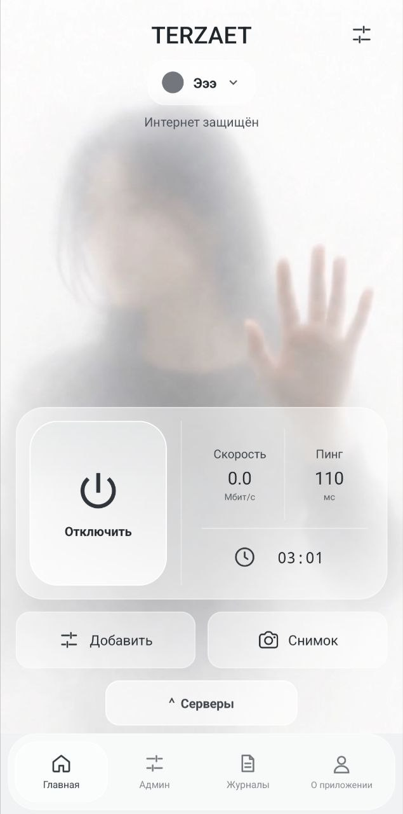
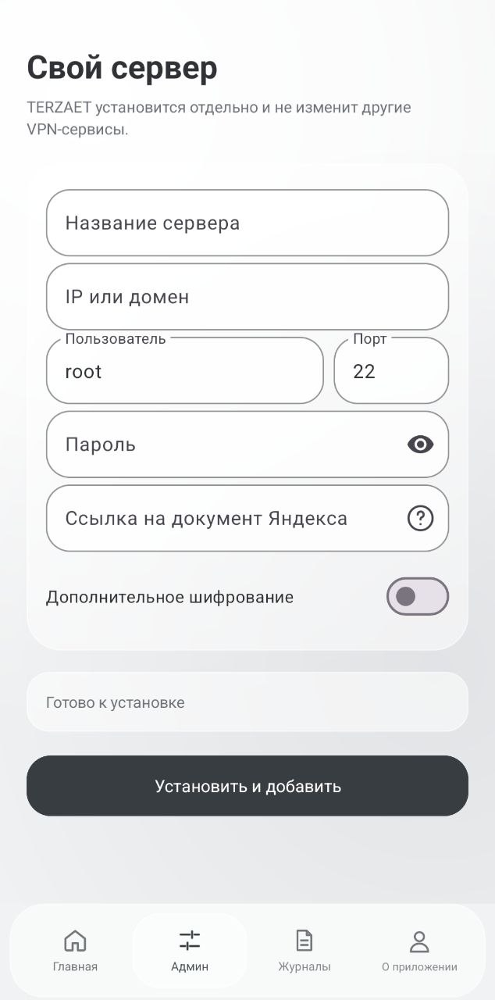

# TERZAET

TERZAET — независимый неофициальный форк OpenFluxAndroid/OpenFlux с отдельной серверной частью для VDS.

<table>
  <tr>
    <td align="center">
      
      <br>
      <sub>Главный экран</sub>
    </td>
    <td align="center">
      
      <br>
      <sub>Установка собственного сервера</sub>
    </td>
  </tr>
</table>

Минималистичный интерфейс, понятные состояния подключения и управление сервером из одного места.

## Установка на VDS

Откройте в приложении раздел «Админ», укажите имя сервера, адрес VDS, пользователя, пароль SSH и публичную ссылку на документ Яндекса. При необходимости можно включить дополнительное шифрование.

Приложение проверит доступность VDS, подготовит Docker, установит TERZAET и добавит конфигурацию автоматически.

Для ручной установки на сервере:

```bash
export TERZAET_DOC_URL='https://disk.yandex.ru/i/...'
curl -fsSL https://raw.githubusercontent.com/TEPZAET/TERZAET/main/server/scripts/install-terzaet.sh | sudo -E sh
```

С дополнительным шифрованием:

```bash
export TERZAET_DOC_URL='https://disk.yandex.ru/i/...'
export TERZAET_ENCRYPTION_KEY='your-secret-key-at-least-16-characters'
curl -fsSL https://raw.githubusercontent.com/TEPZAET/TERZAET/main/server/scripts/install-terzaet.sh | sudo -E sh
```

Поддерживаются системы с `apt`, `dnf`, `yum` или `apk`. Установщик не изменяет и не удаляет Amnezia VPN.
## Что улучшено

- Переработан интерфейс приложения.
- Добавлена установка серверной части на собственный VDS прямо из приложения.
- Поддерживаются классические и новые Яндекс Документы — подходящий режим определяется автоматически.
- Добавлено управление несколькими серверами.
- Добавлено автоматическое восстановление соединения после смены Wi‑Fi или мобильной сети.
- Ограничено количество попыток восстановления.
- Добавлены понятные состояния подключения и уведомления о восстановлении.
- Сервер можно обновить с телефона с автоматическим восстановлением предыдущей версии при ошибке.
- SSH-пароль используется только во время операции и не сохраняется.
- Дополнительное шифрование доступно по желанию.- Улучшены стабильность туннеля и обработка сетевых ошибок.

## Происхождение

TERZAET — независимый неофициальный форк [OpenFluxAndroid](https://github.com/p1neappleXpress/OpenFluxAndroid) и [OpenFlux](https://github.com/p1neappleXpress/OpenFlux). Проект не связан с авторами оригинальных репозиториев. Права на исходные компоненты, зависимости и сторонний код принадлежат их соответствующим авторам. Код предоставляется как есть, без гарантий.
